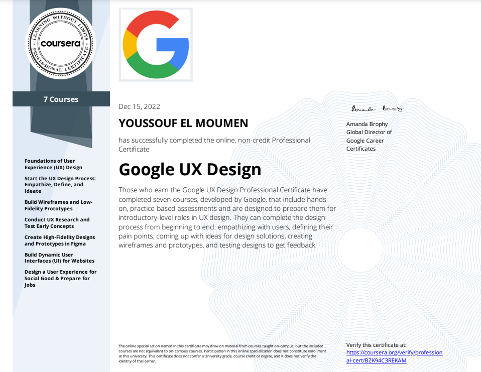

# Google UX Design Specialization
-   [Course Link](https://www.coursera.org/professional-certificates/google-ux-design)
-   [My Certificate](https://certificates.cs50.io/b1b40aca-5873-48f4-b612-21cd620c7ef1.pdf?size=letter)

🎉 Completed by **YOUSSOUF EL MOUMEN**
📅 December 15, 2022

## Time and Effort

⏰ Approximately 6 months at 10 hours a week to complete

## Certification

✅ **YOUSSOUF EL MOUMEN's account is verified.**
Coursera certifies their successful completion of **Google UX Design Specialization.**

## Course Certificates Completed

1. Design a User Experience for Social Good & Prepare for Jobs
2. Conduct UX Research and Test Early Concepts
3. Build Dynamic User Interfaces (UI) for Websites
4. Foundations of User Experience (UX) Design
5. Build Wireframes and Low-Fidelity Prototypes
6. Create High-Fidelity Designs and Prototypes in Figma
7. Start the UX Design Process: Empathize, Define, and Ideate

## Certificate

📜 
